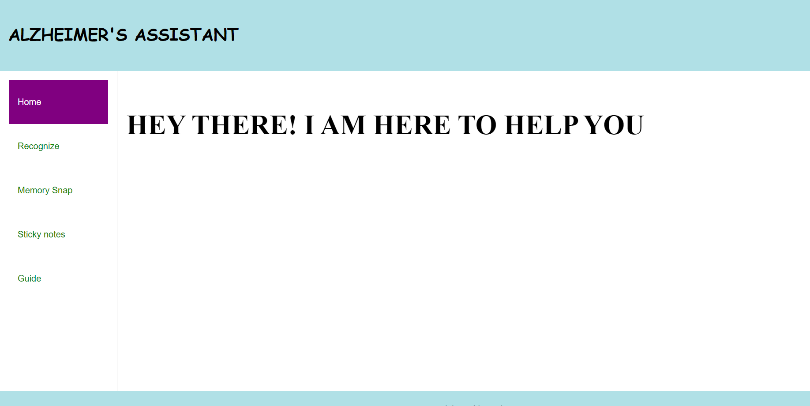
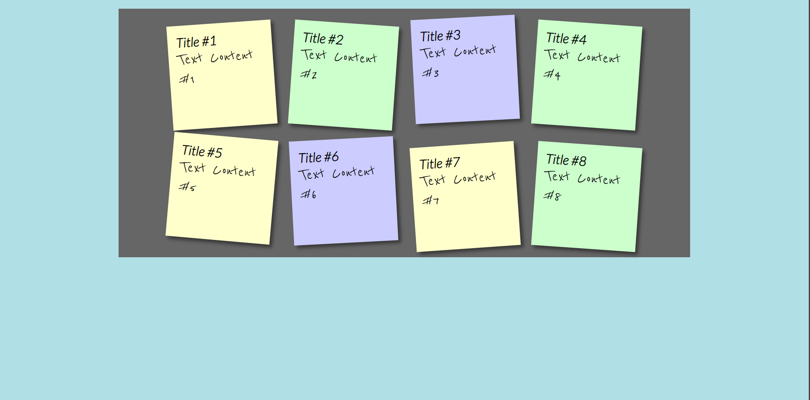
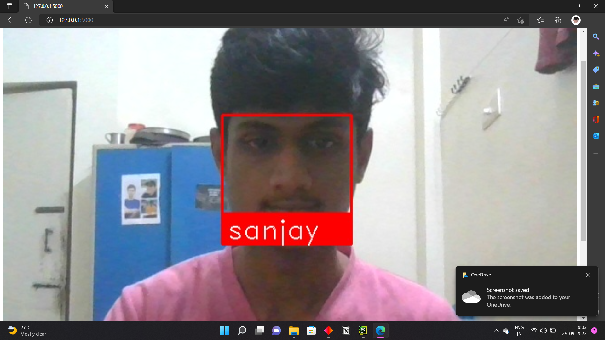
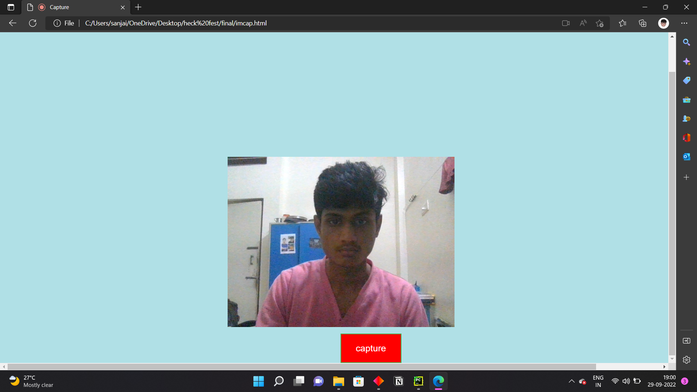

# Alzheimers_Assisstant_Web_App

#ABOUT:
    This is Web App created for ALzheimer 's patient  main  Aim of this project is that 
    Alzheimer 's patient Forget  Every thing within a short span of time ,they also forget
    their closer relatives and because of this they become so stressed  so we created a 
    web app  this project is created  in 24 hr hackathon .

#Main Features  
This is the home page of our website

second feature is the sticky notes feature where the user  can add important
things in this sticky notes and  set remainder.

next is the main feature which to recogonise a person and say who is he 

if you want to store a new person you can use memory snap option
